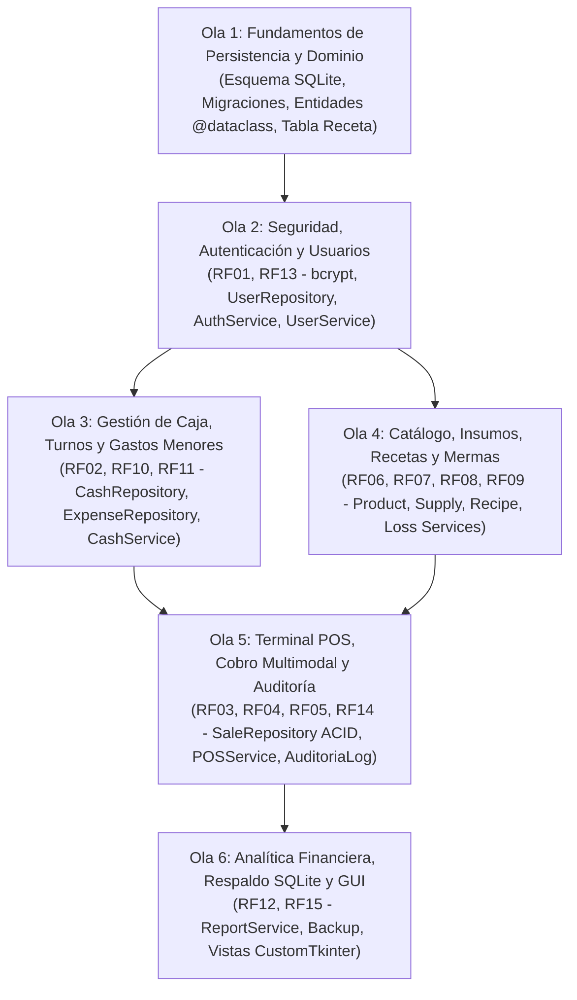

# Roadmap Técnico de Desarrollo y Matriz de Trazabilidad por Olas

> **Documento:** `docs/roadmap.md`  
> **Versión:** 1.0 (Línea Base Oficial del Proyecto)  
> **Proyecto:** Sistema de Gestión Comercial, Control de Inventario, Caja y POS para Heladería  
> **Tech Lead y Arquitecto:** Erickson Sojo  
> **Especificación Base:** IEEE Std 830-1998 (15 Requerimientos Funcionales, 6 Requisitos No Funcionales)

---

## 1. Propósito y Gobernanza del Roadmap

Este documento constituye la **fuente canónica local de verdad** para la planificación, priorización y seguimiento de las tareas del proyecto. 

El desarrollo se organiza bajo el principio de **dependencia estricta por capas**:
$$\text{Persistencia (DB)} \longrightarrow \text{Dominio (Domain)} \longrightarrow \text{Seguridad y Utilidades (Core)} \longrightarrow \text{Repositorios (SQL)} \longrightarrow \text{Servicios (Casos de Uso)} \longrightarrow \text{Interfaz Gráfica (UI)}$$

Bajo esta premisa, ninguna capa superior se implementa si las capas subyacentes de las que depende no han sido consolidadas y verificadas mediante pruebas automatizadas (`unittest`).

---

## 2. Mapa Global de Olas de Desarrollo



---

## 3. Desglose Detallado por Olas de Desarrollo

---

### 🌊 OLA 1: Fundamentos de Persistencia, Dominio y Modelo de Datos
*Objetivo: Consolidar la base de datos relacional SQLite3, los gestores transaccionales ACID y los modelos inmutables de dominio.*

- [x] **1.1. Factoría de Conexión y Context Managers ACID**
  - Archivo: `database/connection.py`
  - Implementar `get_connection()`, `get_db_transaction()` y `get_db_cursor()`.
  - Configurar `PRAGMA foreign_keys = ON;` y `sqlite3.Row`.
- [x] **1.2. Esquema Relacional DDL Canónico (11 Tablas Base)**
  - Archivo: `database/schema.sql`
  - Tablas: `Rol`, `Usuario`, `Categoria`, `Producto`, `Insumo`, `Caja`, `Venta`, `DetalleVenta`, `Gasto`, `Merma`, `AuditoriaLog`.
  - Índices estratégicos y datos semilla (`admin` con hash bcrypt).
- [x] **1.3. Módulo de Inicialización y Migraciones**
  - Archivo: `database/migrations.py`
  - Verificación de tablas existentes e integridad referencial (`PRAGMA foreign_key_check;`).
- [x] **1.4. Entidades Puras del Dominio de Negocio**
  - Directorio: `src/domain/`
  - Modelar mediante `@dataclass` limpias e inmutables con métodos `validar()`: `Rol`, `Usuario`, `Categoria`, `Producto`, `Insumo`, `TurnoCaja`, `Arqueo`, `Venta`, `DetalleVenta`, `Gasto`, `Merma`, `AuditoriaLog`.
- [x] **1.5. Suite de Pruebas Unitarias de Fundamentos (34 Tests)**
  - Archivos: `tests/test_database.py`, `tests/test_domain_entities.py`.
- [x] **1.6. Incorporación de la Tabla y Entidad `Receta` (Composición Producto-Insumo)**
  - **Motivación técnica:** Permitir que las ventas en el POS descuenten automáticamente las porciones e insumos exactos correspondientes a cada producto (RF04/RF08).
  - Tarea 1.6.1: Crear migración DDL en `database/schema.sql` para la tabla `Receta`:
    ```sql
    CREATE TABLE IF NOT EXISTS Receta (
        id_receta INTEGER PRIMARY KEY AUTOINCREMENT,
        id_producto INTEGER NOT NULL,
        id_insumo INTEGER NOT NULL,
        cantidad_necesaria REAL NOT NULL CHECK (cantidad_necesaria > 0.0),
        FOREIGN KEY (id_producto) REFERENCES Producto (id_producto) ON DELETE CASCADE,
        FOREIGN KEY (id_insumo) REFERENCES Insumo (id_insumo) ON DELETE RESTRICT
    );
    CREATE INDEX IF NOT EXISTS idx_receta_producto ON Receta (id_producto);
    ```
  - Tarea 1.6.2: Modelar `@dataclass` `Receta` en `src/domain/recipe.py` y exportarla en `src/domain/__init__.py`.
  - Tarea 1.6.3: Agregar pruebas unitarias en `tests/test_domain_entities.py` para la entidad `Receta`.

---

### 🌊 OLA 2: Seguridad Criptográfica, Autenticación y Control de Usuarios
*Objetivo: Implementar la seguridad con bcrypt, el repositorio de usuarios y la autenticación segmentada por roles.*  
*Requerimientos IEEE 830 cubiertos: **RF01** (Login), **RF13** (Gestión de Usuarios), **RNF02** (Criptografía).*

- [x] **2.1. Módulo Centralizado de Seguridad (`src/core/security.py`)**
  - Implementar `hash_password(plain_password: str) -> str` usando `bcrypt.hashpw` con salt dinámico (`gensalt()`).
  - Implementar `verify_password(plain_password: str, hashed_password: str) -> bool` usando `bcrypt.checkpw`.
  - Validar que los hashes generados cumplan la longitud fija de 60 caracteres.
- [x] **2.2. Repositorio de Usuarios (`src/repositories/user_repository.py`)**
  - `obtener_por_id(id_usuario: int) -> Optional[Usuario]`
  - `obtener_por_username(username: str) -> Optional[Usuario]`
  - `crear_usuario(usuario: Usuario) -> int`
  - `actualizar_usuario(usuario: Usuario) -> bool`
  - `cambiar_password(id_usuario: int, nuevo_hash: str) -> bool`
  - `cambiar_estado(id_usuario: int, nuevo_estado: int) -> bool`
  - `listar_usuarios(solo_activos: bool = False) -> List[Usuario]`
- [x] **2.3. Servicio de Autenticación (`src/services/auth_service.py`)**
  - `autenticar(username: str, password_plana: str) -> Usuario`
  - Validaciones: usuario existente, estado activo (`estado == 1`), verificación criptográfica contra `password_hash`.
  - Manejo de sesión actual en memoria (`usuario_autenticado`).
  - Registro de auditoría ante inicios de sesión exitosos y fallidos.
- [x] **2.4. Servicio de Gestión de Usuarios (`src/services/user_service.py`)**
  - Reglas de negocio para roles (Administrador vs. Empleado) y matriz de capacidades (`has_permission`).
  - Validación de unicidad de username y complejidad mínima de contraseña.
- [x] **2.5. Pruebas Automatizadas de la Ola 2**
  - `tests/test_security.py`: Verificación de generación de salt, hashes válidos y rechazo de contraseñas incorrectas.
  - `tests/test_user_repository.py`: CRUD parametrizado contra base de datos de pruebas en memoria.
  - `tests/test_auth_service.py`: Casos de login correcto, credenciales inválidas y usuario inactivo.
  - `tests/test_user_service.py`: Casos de creación, validación de permisos, actualización, contraseñas, estados, auditoría y protección del último admin (37 tests).

---

### 🌊 OLA 3: Gestión de Caja, Turnos y Gastos Operativos de Caja Menor
*Objetivo: Administrar el ciclo de vida del turno de caja (apertura, egresos menores y arqueo conciliado).*  
*Requerimientos IEEE 830 cubiertos: **RF02** (Apertura de Turno), **RF10** (Gastos de Caja Menor), **RF11** (Arqueo y Cierre).*

- [x] **3.1. Repositorio de Caja (`src/repositories/cash_repository.py`)**
  - `abrir_caja(id_usuario: int, monto_inicial: float, fecha_hora: str) -> int`
  - `obtener_caja_activa() -> Optional[TurnoCaja]`
  - `cerrar_caja(id_caja: int, monto_final_real: float, diferencia: float, fecha_hora: str) -> bool`
  - `obtener_caja_por_id(id_caja: int) -> Optional[TurnoCaja]`
- [x] **3.2. Repositorio de Gastos (`src/repositories/expense_repository.py`)**
  - `registrar_gasto(gasto: Gasto) -> int`
  - `listar_gastos_por_caja(id_caja: int) -> List[Gasto]`
  - `calcular_total_gastos(id_caja: int) -> float`
- [x] **3.3. Servicio de Turnos y Caja (`src/services/cash_service.py`)**
  - Apertura obligatoria: Bloqueo de POS si no existe turno abierto (`CajaCerradaError`).
  - Prevención de doble apertura concurrente (`CajaYaAbiertaError`).
  - Arqueo al cierre:
    $$\text{Saldo Esperado} = \text{Monto Inicial} + \sum \text{Ventas en Efectivo} - \sum \text{Gastos}$$
    $$\text{Diferencia} = \text{Monto Físico Declarado} - \text{Saldo Esperado}$$
    - Diferencia $> 0 \implies \text{Sobrante}$
    - Diferencia $< 0 \implies \text{Faltante}$
    - Diferencia $= 0 \implies \text{Cuadre Exacto}$
- [x] **3.4. Servicio de Gastos Menores (`src/services/expense_service.py`)**
  - Validación de monto positivo y descripción justificada.
  - Verificación de liquidez suficiente en la gaveta antes de autorizar el egreso.
- [x] **3.5. Pruebas Automatizadas de la Ola 3**
  - `tests/test_cash_service.py`: Simulación de turno completo con monto inicial, gastos y conciliación matemática de arqueo.

---

### 🌊 OLA 4: Catálogo Comercial, Insumos, Recetas y Mermas
*Objetivo: Controlar el portafolio de productos, la bodega de materias primas, su composición y las pérdidas justificadas.*  
*Requerimientos IEEE 830 cubiertos: **RF06** (Catálogo), **RF07** (Insumos), **RF08** (Stock Mínimo), **RF09** (Mermas).*

- [ ] **4.1. Repositorios de Catálogo (`category_repository.py`, `product_repository.py`)**
  - CRUD completo de `Categoria` y `Producto`.
  - Filtro por categoría comercial y estado (activo/suspendido).
  - Consulta rápida por código de producto (indexada en SQLite).
- [ ] **4.2. Repositorio de Insumos y Bodega (`supply_repository.py`)**
  - CRUD de insumos (nombre, unidad de medida, stock actual, stock mínimo).
  - `descontar_stock(id_insumo: int, cantidad: float) -> bool`
  - `aumentar_stock(id_insumo: int, cantidad: float) -> bool`
  - `obtener_insumos_en_alerta() -> List[Insumo]` (donde `stock_actual <= stock_minimo`).
- [ ] **4.3. Repositorio de Recetas (`recipe_repository.py`)**
  - `asociar_insumo_a_producto(id_producto: int, id_insumo: int, cantidad: float) -> int`
  - `obtener_receta_por_producto(id_producto: int) -> List[Receta]`
  - `eliminar_insumo_de_receta(id_receta: int) -> bool`
- [ ] **4.4. Repositorio de Mermas (`loss_repository.py`)**
  - `registrar_merma(merma: Merma) -> int`
  - Descuento inmediato de stock del insumo involucrado sin impacto dinerario en caja.
- [ ] **4.5. Capa de Servicios de Inventario y Catálogo**
  - `catalog_service.py`: Validaciones de precios $\ge 0.0$ y nombres no vacíos.
  - `inventory_service.py`: Notificación de alertas de stock mínimo y reposición de bodega.
  - `loss_service.py`: Exigencia de motivo justificado para cada descarte.
- [ ] **4.6. Pruebas Automatizadas de la Ola 4**
  - `tests/test_catalog_service.py`, `tests/test_inventory_service.py`.

---

### 🌊 OLA 5: Terminal de Punto de Venta (POS), Cobro Multimodal y Auditoría Transaccional
*Objetivo: Procesar la venta en mostrador de forma ágil, atómica (ACID) y con registro inalterable de auditoría.*  
*Requerimientos IEEE 830 cubiertos: **RF03** (POS), **RF04** (Cobro Multimodal), **RF05** (Detalle Venta), **RF14** (Auditoría).*

- [ ] **5.1. Repositorio de Ventas Transaccional (`src/repositories/sale_repository.py`)**
  - Ejecutar bajo un único bloque atómico con `get_db_transaction()`:
    1. Inserción de cabecera en `Venta`.
    2. Inserción de $N$ partidas en `DetalleVenta`.
    3. Para cada ítem vendido, consultar su `Receta` y ejecutar `descontar_stock` en `Insumo`.
    4. Inserción del evento en `AuditoriaLog`.
  - Disparo de `rollback` automático ante fallo en cualquiera de los pasos.
- [ ] **5.2. Repositorio de Auditoría (`src/repositories/audit_repository.py`)**
  - Inserción inalterable en `AuditoriaLog` (timestamp, id_usuario, módulo, acción, detalles).
  - Consulta de logs filtrables por rango de fechas o usuario.
- [ ] **5.3. Servicio de Punto de Venta (`src/services/pos_service.py`)**
  - Validación de turno de caja abierto antes de iniciar comanda.
  - Cálculo automático de subtotales, totales y recargos por toppings.
  - Modalidades de cobro multimodal:
    - *Efectivo:* Exigir $\text{dinero\_recibido} \ge \text{total}$, calcular $\text{cambio} = \text{recibido} - \text{total}$.
    - *Transferencias (Nequi, Daviplata, QR):* $\text{dinero\_recibido} = \text{total}$, $\text{cambio} = 0.0$.
  - Comprobación preventiva de stock de insumos antes de consolidar la transacción (`StockInsuficienteError`).
- [ ] **5.4. Pruebas Automatizadas de la Ola 5**
  - `tests/test_pos_service.py`: Simulación de ventas con múltiples líneas, cálculo de devuelta y verificación de atomicidad ante fallos inducidos.

---

### 🌊 OLA 6: Analítica Financiera, Respaldo SQLite e Interfaz Gráfica (CustomTkinter)
*Objetivo: Consolidar las estadísticas de negocio, la copia de seguridad física y la interfaz visual modular.*  
*Requerimientos IEEE 830 cubiertos: **RF12** (Reportes), **RF15** (Respaldo Local), **RNF01** (< 200 MB RAM), **RNF03** (Usabilidad).*

- [ ] **6.1. Servicio de Reportes Financieros (`src/services/report_service.py`)**
  - Consolidación de ingresos por ventas brutas y netas (descontando gastos menores).
  - Reportes filtrables: Diario, Semanal y Mensual.
  - Ranking de productos más vendidos y sabores de helado de mayor rotación.
- [ ] **6.2. Módulo de Copia de Seguridad Local (`database/backup.py`)**
  - Exportación con un solo clic de `heladeria.db` hacia una unidad extraíble USB o carpeta de destino.
  - Generación de nombre con timestamp (`heladeria_backup_YYYYMMDD_HHMMSS.db`).
- [ ] **6.3. Componentes Visuales Reutilizables con CustomTkinter (`src/ui/components/`)**
  - Barra lateral de navegación (`SidebarNavigation`).
  - Cuadrícula táctil de catálogo para mostrador (`ProductGrid`).
  - Tabla de comanda interactiva (`CartView`).
  - Diálogo modal de cobro y cálculo de devuelta (`PaymentModal`).
- [ ] **6.4. Vistas del Sistema (`src/ui/views/`)**
  - `LoginView`: Pantalla de bienvenida y autenticación (RF01).
  - `CashTurnView`: Apertura y arqueo conciliado de caja (RF02, RF11).
  - `POSView`: Terminal ágil de comandas en mostrador (RF03, RF04, RF05).
  - `InventoryView`: Control de insumos, recetas y alertas de stock (RF07, RF08).
  - `LossView`: Registro de mermas y descartes (RF09).
  - `ExpenseView`: Registro de gastos de caja menor (RF10).
  - `ReportsView`: Estadísticas y ganancias para Administrador (RF12).
  - `UsersView`: Gestión de personal y contraseñas (RF13).
- [ ] **6.5. Punto de Entrada Principal (`main.py`)**
  - Inicialización limpia, verificación de integridad de base de datos y arranque de la ventana CustomTkinter.
- [ ] **6.6. Verificación de Restricciones Operativas**
  - Validación de consumo de RAM $< 200\text{ MB}$ con destrucción explícita de vistas (`destroy()`).
  - Latencia de respuesta $< 0.3\text{ s}$ en consultas de catálogo y cobro.

---

## 4. Matriz de Trazabilidad: Requerimientos IEEE 830 vs. Olas

| Requisito Funcional | Nombre Oficial | Ola de Desarrollo | Capas Involucradas |
| :--- | :--- | :---: | :--- |
| **RF01** | Autenticación de Usuarios y Login | **Ola 2** | `core`, `repositories`, `services`, `ui` |
| **RF02** | Apertura de Turno de Caja con Fondo Base | **Ola 3** | `domain`, `repositories`, `services`, `ui` |
| **RF03** | Punto de Venta (POS) y Comandas Rápidas | **Ola 5** | `repositories`, `services`, `ui` |
| **RF04** | Flexibilidad en Pedidos y Cobro Multimodal | **Ola 5** | `domain`, `repositories`, `services`, `ui` |
| **RF05** | Generación y Detalle de Venta | **Ola 5** | `domain`, `repositories`, `services` |
| **RF06** | Catálogo de Productos y Categorías (CRUD) | **Ola 4** | `domain`, `repositories`, `services`, `ui` |
| **RF07** | Control Integral de Insumos y Bodega | **Ola 4** | `domain`, `repositories`, `services`, `ui` |
| **RF08** | Descuento por Recetas y Alertas de Stock | **Ola 1 y 4** | `database`, `repositories`, `services` |
| **RF09** | Registro y Cuantificación de Mermas | **Ola 4** | `domain`, `repositories`, `services`, `ui` |
| **RF10** | Gastos Operativos de Caja Menor | **Ola 3** | `domain`, `repositories`, `services`, `ui` |
| **RF11** | Cierre de Turno y Arqueo Conciliado | **Ola 3** | `domain`, `repositories`, `services`, `ui` |
| **RF12** | Reportes Financieros y Ganancias Netas | **Ola 6** | `repositories`, `services`, `ui` |
| **RF13** | Administración de Usuarios y Roles | **Ola 2** | `core`, `repositories`, `services`, `ui` |
| **RF14** | Auditoría, Trazabilidad y Logs | **Ola 5** | `domain`, `repositories`, `services` |
| **RF15** | Respaldo Físico Local del Archivo SQLite | **Ola 6** | `database`, `services`, `ui` |
